## CHIRIMEN 対応デバイスリスト

市販のセンサーやアクチュエータなどのうち、CHIRIMEN 環境での利用を検証し配線図とサンプルコード一式 (I2C デバイスは CHIRIMEN 用ドライバー含む) を用意しているデバイスの一覧です。

こちらに掲載がないデバイスについても、デジタル GPIO デバイスであればそのまま、アナログ GPIO デバイスであれば ADC を経由で簡単に利用頂けます (I2C デバイスについてはドライバーの用意も必要です)。

### I2C センサー

| カテゴリー                                   | 型番                                                       | 説明                                                                                                                                                                                                     | 画像 URL                                   |                                       QR                                       |
| :------------------------------------------- | :--------------------------------------------------------- | :------------------------------------------------------------------------------------------------------------------------------------------------------------------------------------------------------- | :----------------------------------------- | :----------------------------------------------------------------------------: |
| ADC(アナログ電圧測定)                        | ADS1015                                                    | アナログ電圧を 12bit 精度のデジタル信号に変換する部品で、アナログセンサ等を利用する際に必要です                                                                                                          | 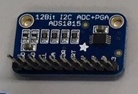        |                  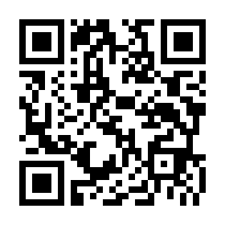                  |
| ADC(アナログ電圧測定)                        | ADS1115                                                    | アナログ電圧を 16bit 精度のデジタル信号に変換する部品で、アナログセンサ等を利用する際に必要です                                                                                                          |         |                  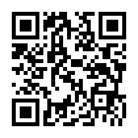                  |
| ADC DAC(アナログ電圧出力) 複合               | PCF8591                                                    | ADC と DAC が一つになった部品です(デジタル側は 8bit)                                                                                                                                                     |         |                                    |
| 温度センサ                                   | ADT7410                                                    | -55℃ から +150℃ まで測定できる温度センサです                                                                                                                                                             |         |                  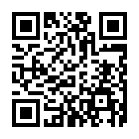                  |
| サーモグラフィ                               | AMG8833                                                    | センサから見て上下左右のおよそ 60 度の範囲を 8x8 ピクセルに分割し、それぞれのエリアについて 0℃ ～ 80℃ の範囲で測定可能なサーモグラフィです                                                               | 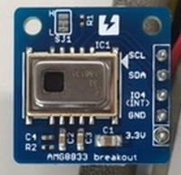        |                                    |
| 温度 圧力 湿度 複合センサ                    | BME280                                                     | 温度、湿度、気圧の測定ができる複合センサです                                                                                                                                                             |          |                                     |
| 温度 圧力 複合センサ                         | BMP180                                                     | 温度と気圧の測定ができる複合センサです                                                                                                                                                                   |          |                                     |
| 温度 圧力 複合センサ                         | BMP280                                                     | 温度と気圧の測定ができる複合センサです(BMP180 の後継品で精度が向上しています)                                                                                                                            | 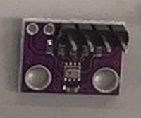        |                                     |
| 距離センサ                                   | GP2Y0E03                                                   | センサから対象物までの距離を測定できるセンサです( 50cm 程度まで)                                                                                                                                         |        |                                   |
| 距離センサ                                   | VL53L0X                                                    | センサから対象物までの距離を測定できるセンサです( 2m 程度まで)                                                                                                                                           |         |                  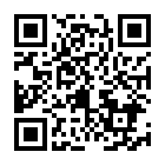                  |
| ジェスチャーセンサ                           | Grove-Gesture (PAJ7620U2)                                  | 手を「上、下、左、右、遠ざかる、近づく、時計回り、反時計回り、手を振る」と動かしたときにそれらを検出するセンサです                                                                                       |   |          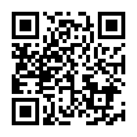          |
| 光センサ                                     | Grove-Light (TSL2561)                                      | 0.1lx から 40000lx まで測定可能な照度センサです                                                                                                                                                          |     |            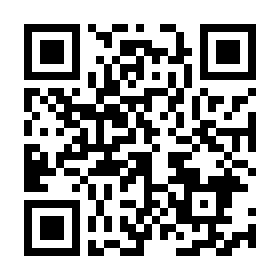            |
| 小型ディスプレイ Grove-OledDisplay (SSD1308) | 0.96inch、128x64dot の小型 OLED (有機 EL) ディスプレイです | -                                                                                                                                                                                                        | -                                          |                  |
| タッチセンサ                                 | Grove-Touch (MPR121)                                       | 指などの接触を検出するセンサです                                                                                                                                                                         | -                                          |            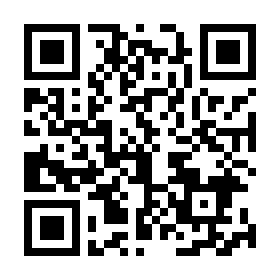             |
| カラーセンサ                                 | S11059                                                     | RGB 各色と赤外線の強度を測定するセンサです                                                                                                                                                               |          |                  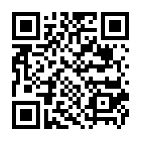                   |
| 紫外線(UV)センサ                             | VEML6070                                                   | 紫外線の強度を測定できるセンサです                                                                                                                                                                       |        |                 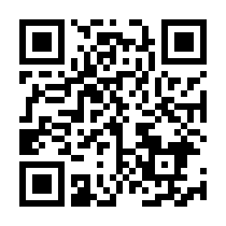                  |
| 3 軸加速度センサ                             | Grove-Accelerometer (ADXL345)                              | 3 軸の加速度を検出できるセンサです                                                                                                                                                                       | -                                          |        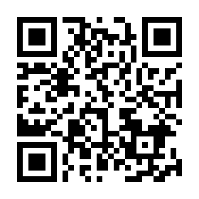        |
| 3 軸加速度+ジャイロ 複合センサ               | MPU6050                                                    | 3 軸の加速度に加え、ジャイロの測定も可能な複合センサです                                                                                                                                                 |         |                                 |
| 3 軸加速度+ジャイロ+磁気 複合センサ          | MPU9250                                                    | 3 軸の加速度、ジャイロのほか、磁気も測定可能な複合センサです                                                                                                                                             |        |                  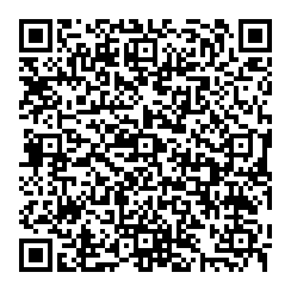                  |
| フルカラー LED アレイ                        | Neopixel LED コントローラ                                  | 多数のフルカラー LED を個々に制御可能なコントローラです(詳細は Examples をご覧ください)                                                                                                                  |     |                    |
| フルカラー LED アレイ                        | Neopixel LED 8x8                                           | NEOPIXEL 対応の 8x8 LED パネルです                                                                                                                                                                       |      |   |
| フルカラー LED アレイ                        | Neopixel LED 12x12                                         | 円形のパネルです                                                                                                                                                                                         |      |                                       -                                        |
| フルカラー LED アレイ                        | Neopixel LED 60x60                                         | 20 個のパネルを 3 つ組み合わせることで 60 個のパネルとなります                                                                                                                                           |      |                                       -                                        |
| LED マトリックス                             | HT16K33 搭載 8x8LED モジュール（その１）                   | マトリクス LED 制御可能なコントローラが搭載された LED モジュールです(詳細は Examples をご覧ください)。 Adafruit の 8x8LED 搭載品と　 Keyestudio KS0336 8\*8 Matrix Module I2C はピン配置を除き同等品です |         |   |
| LED マトリックス                             | HT16K33 搭載 8x8LED モジュール（その２）                   | 上記と同等のコントローラですが、LED の論理配列が異なる aitendo 製 8x8LED モジュールです。ドライバの設定が若干個なります。                                                                                |  |   |
| LED マトリックス                             | HT16K33 搭載 16x8LED モジュール                            | 上記と同等のコントローラが載った、16x8 マトリクス LED のモジュールです。                                                                                                                                 |    |            |
| LED マトリックス                             | HT16K33 搭載 7 セグメント LED モジュール                   | 上記と同等のコントローラが載った、7 セグメント LED のモジュールです。                                                                                                                                    |    |  |
| LED マトリックス                             | HT16K33 搭載 14 セグメント LED モジュール                  | 上記と同等のコントローラが載った、14 セグメント LED のモジュールです。                                                                                                                                   |   |    |
| サーボモータ・DC モータ コントローラ         | PCA9685                                                    | サーボモータを PWM 制御できる部品で、サーボモータを利用する際に必要です                                                                                                                                  |         |                  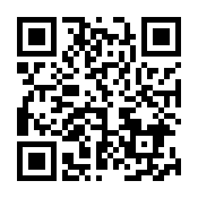                  |
| サーボモータ                                 | SG90 Servo                                                 | アームを指定した角度をに動かすことのできる部品です                                                                                                                                                       | -                                          |                               |
| サーボモータ・DC モータ コントローラ         | PCA9685 PWM                                                | 詳細は Examples をご覧ください                                                                                                                                                                           |         |                              |
| 温湿度複合センサ                             | SHT30/31                                                   | 温度と湿度の両方が測定可能なセンサ                                                                                                                                                                       |           |                 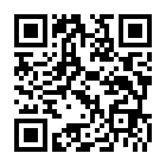                  |
| 温湿度複合センサ                             | AHT10                                                      | 温度と湿度の両方が測定可能なセンサ                                                                                                                                                                       |           |                                      |
| 温湿度複合センサ                             | HTU21D                                                     | 温度と湿度の両方が測定可能なセンサ                                                                                                                                                                       |          |                  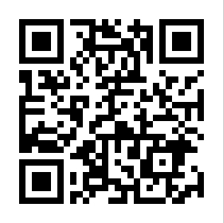                   |
| 色センサ                                     | TCS34725                                                   | I2C 接続の色センサー                                                                                                                                                                                     |        |                 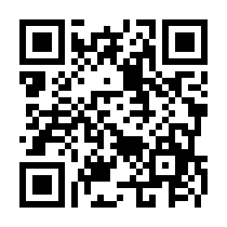                  |
| レーザー距離センサ                           | VL53L1X                                                    | VL53L0X より高出力長距離タイプ                                                                                                                                                                           |         |                  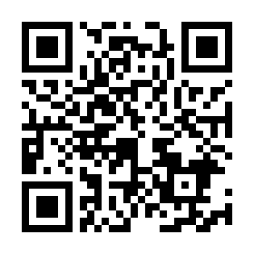                  |
| 電流センサ                                   | INA219                                                     | 比較的大きな DC 電流を測定するセンサ                                                                                                                                                                     |          |                  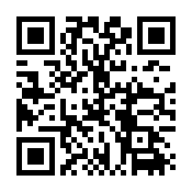                   |
| 非接触温度センサ                             | MLX90614                                                   | 赤外線を利用した非接触型温度センサー                                                                                                                                                                     |        |                 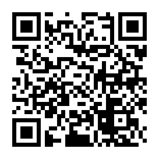                  |
| 近接・環境光・ジェスチャーセンサー           | APDS9960                                                   | 近接・環境光・ジェスチャーを読み取るセンサー                                                                                                                                                             |        |                 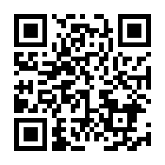                  |
| 多目的インターフェース                       | seesaw                                                     | デジタル・アナログ入力・PWM 出力・NeopixelLED ドライブ等の機能を持つ多目的ボード                                                                                                                         |          |                  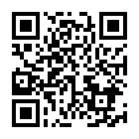                   |
| 照度センサー                                 | BH1750                                                     | 照度センサー                                                                                                                                                                                             |          |                  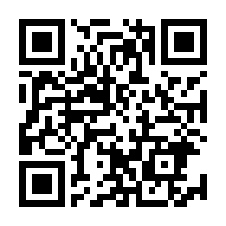                   |
| CO2 センサ                                   | SCD40                                                      | CO2 センサ(CO2 濃度が PPM 値で高精度に計測できるセンサーです)                                                                                                                                            |           |                   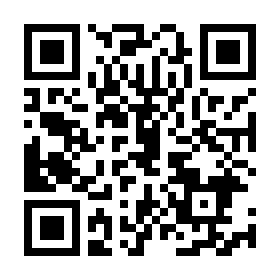                   |
| CO2+TVOC センサ                              | CCS811                                                     | CO2+TVOC センサ                                                                                                                                                                                          |          |                  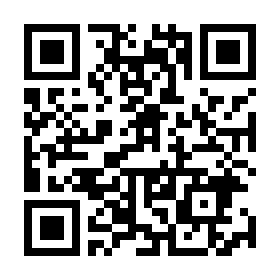                   |
| 温度 湿度 気圧 ガス 複合センサ               | BME680                                                     | 温度、湿度、気圧さらにガスが測れる複合センサです                                                                                                                                                         |          |                  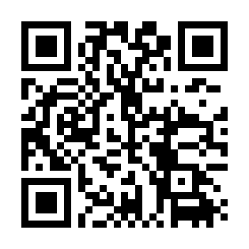                   |

### GPIO センサー・アクチュエータコントローラー

| カテゴリー                     | 型番                         | 説明                                                                                                               | 画像 URL                               |                               QR                                |
| :----------------------------- | :--------------------------- | :----------------------------------------------------------------------------------------------------------------- | :------------------------------------- | :-------------------------------------------------------------: |
| LED                            | 赤色 LED                     | 通電すると光る部品です(必ず抵抗を挟んで利用してください)                                                           |         |                     |
| LED                            | 黄色 LED                     | 通電すると光る部品です(必ず抵抗を挟んで利用してください)                                                           |         |          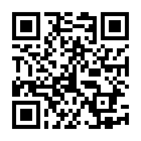           |
| LED                            | 黄緑色 LED                   | 通電すると光る部品です(必ず抵抗を挟んで利用してください)                                                           |         |         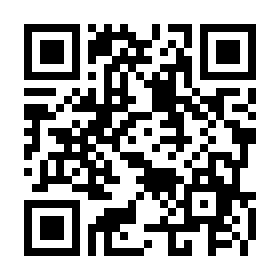          |
| カーボン抵抗                   | 150Ω                         | 必要な場所に電気抵抗を入れる部品です(ここでは通常のものよりサイズが大きく、抵抗値が読みやすい商品を紹介しています) |  |                        |
| カーボン抵抗                   | 10kΩ                         | 必要な場所に電気抵抗を入れる部品です(ここでは通常のものよりサイズが大きく、抵抗値が読みやすい商品を紹介しています) |  |                        |
| カーボン抵抗                   | 1kΩ                          | 必要な場所に電気抵抗を入れる部品です(ここでは通常のものよりサイズが大きく、抵抗値が読みやすい商品を紹介しています) |  |                         |
| タクトスイッチ                 | 2pin                         | ボタンを押している間だけ電気を流す部品です(chirimen チュートリアルでは 2pin のものを採用しています)                |  |            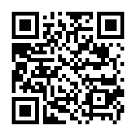            |
| タクトスイッチ                 | 4pin                         | ボタンを押している間だけ電気を流す部品です(chirimen チュートリアルでは 2pin のものを採用しています)                |  |            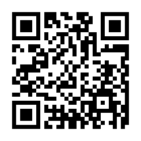            |
| マイクロスイッチ               | SS-10GL13                    | 小型のスイッチです                                                                                                 | 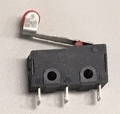   |         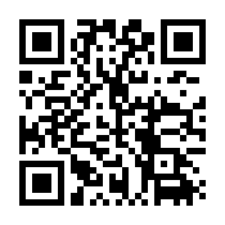          |
| タッチセンサ/スイッチ          | TP223                        | タッチセンサ(スイッチ)です。金属の近接(1-2mm 程度の接近)も感知でき応用が利きます。                                 |       |                       |
| Nch パワー MOSFET              | 2SK4017                      | 直流電流の On/Off 制御を行う部品です                                                                               |         |          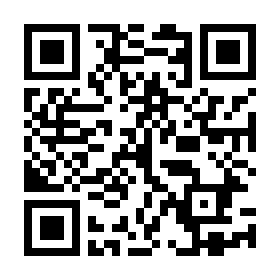           |
| Nch パワー MOSFET モジュール   | IRF520 (ドライバモジュール)  | 上の FET を利用したモーター制御と同等の回路が組まれたモジュールです IRF520 パワー MOSFET が用られています          |        | 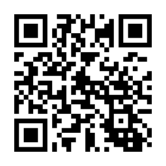  |
| DC モーター 正逆転コントローラ | L298N (ドライバモジュール)   | ST マイクロ社のフルブリッジドライバである L298N を使用した DC モーターコントローラです                             |       |  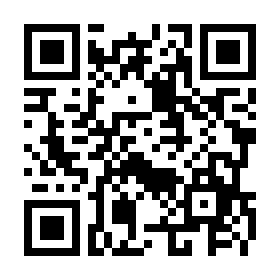  |
| DC モータ 正逆転コントローラ   | L9110S                       | L9110 を使用した DC モータコントローラです                                                                         | 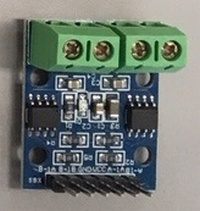    |           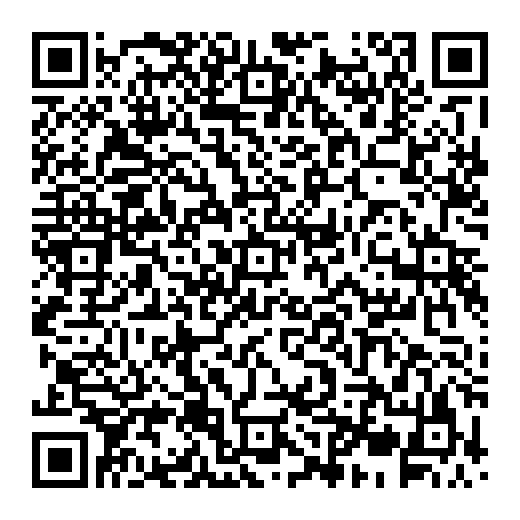           |
| DC モータ 正逆転コントローラ   | MX1508                       | L298N を使用した DC モータコントローラです                                                                         |      |                      |
| DC モータ 正逆転コントローラ   | TB6612FNG                    | TOSHIBA 製 TB6612FNG を利用したモータドライバです                                                                  |   |         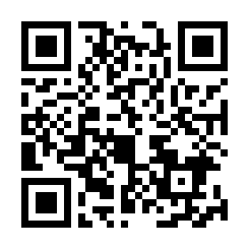          |
| 赤外線人感センサ               | KP-IR412                     | 人体に反応するセンサです                                                                                           |       |          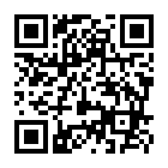          |
| 赤外線人感センサ               | HC-SR501                     | 人体に反応するセンサです                                                                                           |       |          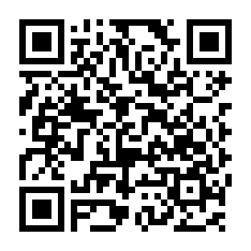          |
| ステッピングモータコントローラ | A4988                        | バイポーラステッピングモータを制御するドライバです                                                                 |       |           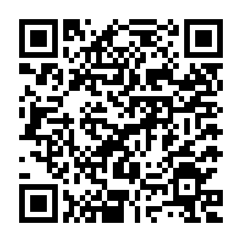            |
| LED                            | フレキシブルＬＥＤ　緑色     | 通電すると光る部品です(必ず抵抗を挟んで利用してください)                                                           |     |   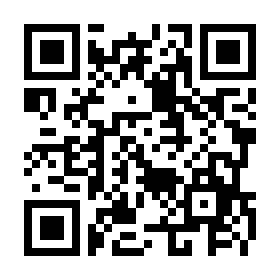   |
| LED                            | フレキシブルＬＥＤ　赤色     | 通電すると光る部品です(必ず抵抗を挟んで利用してください)                                                           |     |   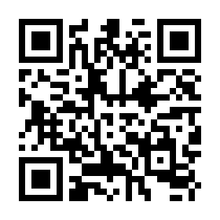   |
| LED                            | フレキシブルＬＥＤ　黄色     | 通電すると光る部品です(必ず抵抗を挟んで利用してください)                                                           |     |   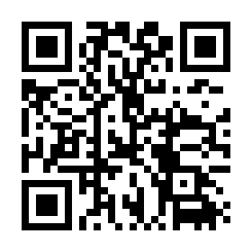   |
| LED                            | フレキシブルＬＥＤ　ピンク色 | 通電すると光る部品です(必ず抵抗を挟んで利用してください)                                                           |     | 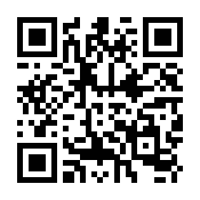 |

### アナログセンサー (I2C ADC で読み取り)

| カテゴリー     | 型番               | 説明                                                                        | 画像 URL                              |                      QR                       |
| :------------- | :----------------- | :-------------------------------------------------------------------------- | :------------------------------------ | :-------------------------------------------: |
| 雨センサ       | RD-4P              | 雨(水)を検出するセンサです(GPIO)                                            |       |  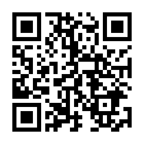   |
| 水センサ       | M-WL-J3Y           | 水を検出するセンサです                                                      |      | 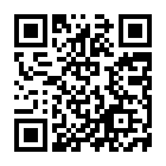 |
| 圧力センサ(小) | FSR 400            | 圧力が検知できるセンサです                                                  |  |  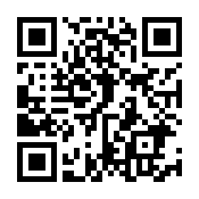  |
| 可変抵抗       | TSR-3386           | 抵抗値を変化させられる抵抗です                                              |         |                       -                       |
| ロードセル     | ジェネリック品多種 | 加重により抵抗値が微少に変化する素子。差動入力にした ADS1115 で利用可能です |   |                       -                       |

### アクチュエータ

| カテゴリー                       | 型番                         | 説明                               | 画像 URL                                 |                           QR                           |
| :------------------------------- | :--------------------------- | :--------------------------------- | :--------------------------------------- | :----------------------------------------------------: |
| サーボモータ                     | SG90                         | Tower Pro 製の小型サーボモータです | -                                        |       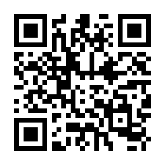        |
| DC モータ                        | 各 Examples をご参照ください | -                                  | -                                        |                           -                            |
| 2 相バイポーラステッピングモータ | 多種(例は TS3692N65)         | A4988 をご参照ください             |  |  |
| ギヤードモータ                   | ちびギヤモータ               | 小型のギヤードモータです           |     |     |

